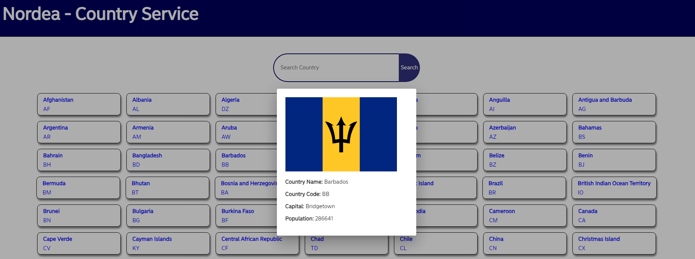
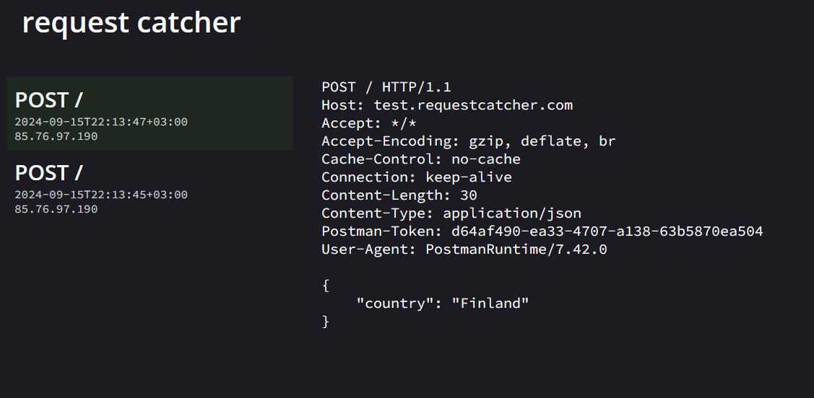

<p align="center">
    
</p>

## Challenge description: COUNTRY SERVICE.

Implement a microservice which provides a list of countries and, in addition, provides more detailed information per country.

- Requirements:
1. Use spring-boot.
	- https://start.spring.io/.
	- https://spring.io/guides/gs/spring-boot/.
2. Use maven.
	- https://spring.io/guides/gs/maven/.
	- https://www.baeldung.com/maven.
3. Use best practices and microservice approach.
4. Implement the following REST API with spring-boot:
 
```
GET /countries/
response:
          {
                   "countries": [
                             {
                                       "name": "Finland",
                                       "country_code": "FI"
                             },
                             ...
                   ]
          }
```
```
GET /countries/{name}
response:
          {
                   "name": "Finland",
                   "country_code": "FI",
                   "capital": "Helsinki",
                   "population": 5491817,
                   "flag_file_url": "<url to the flag file>"
          }
```

5. Country service must fetch the relevant information for countries from some other service.
	- You could use for example the following service: `https://countriesnow.space/`.
6. Test the implementation as well as it's needed from your perspective.
7. All the implementations must be runnable locally with our own computer. Write needed instructions to README.md file.
8. Publish all sources code and relevant files in github or similar service and send the link to the repo so that the implementation can be reviewed.

You get bonus points if:

- You use and understand [Reactor](https://www.baeldung.com/reactor-core).
- You create a separate wep application which utilizes the created REST API and shows the relevant country information in a browser.

## Architecture Explanation.

- [](https://spring.io/), [](https://docs.spring.io/spring-framework/reference/web/webflux.html) and [](https://projectreactor.io/).
    - Since this was in context of **Reactor**. I decided to use reactive approach, **Spring WebFlux**. 
- [](https://docs.spring.io/spring-framework/reference/web/webflux-webclient.html).
    - ✅ **WebClient** ✅ Interacting with 3rd party endpoints, WebClient was chosen for making non-blocking & asynchronous endpoint.
    - ❌ **RestTemplate** ❌ Older way to make calls in Spring and synchronous. [RestTemplate](https://www.baeldung.com/rest-template).
    - ❌ **Feign Client** ❌ Also synchronous. [Feign Client](https://www.baeldung.com/spring-boot-feignclient-vs-webclient).
- [](https://projectreactor.io/docs/netty/1.1.21/reference/index.html).
    - ✅**Netty**✅ is suited for Microservices Architecture, for its non-blocking I/O client-server nature. This for bank end.
    - ❌ **Apache Tomcat** ❌ Default Spring server, more suited to those who would be using Spring MVC.
- [](https://docs.spring.io/spring-framework/reference/web/webflux.html). 
    - ✅**Lombok**✅ For reducing boilerplate code.

- We are making `application.yml` for this microservices.
    - If this microservice would ran in different environment, it would pick up appropriate configurations. 

- Domain classes represents classes inside business logic.

- DTO classes represents REST API and are modeled using `countriesnow.space` API nesting structure. Meaning package names is from API paths and DTO class names tries to represent the given thing. I chose not make DTO classes as reusable as possible, every DTO is unique. [ReadMore](https://www.baeldung.com/java-dto-pattern#common-mistakes).

> We also want to avoid trying to use a single class for many scenarios. 

- I have decided to use **ResponseEntity** in **Controller** class. [ReadMore](https://www.baeldung.com/spring-response-entity).

> While **ResponseEntity** is very powerful, we shouldn’t overuse it. In simple cases, there are other options that satisfy our needs and they result in much cleaner code.

- We are making tests!
    - **Unit Tests**:
        - For Bean Validation.
        - For Controller end points.
    - **Integration Tests**:
        - [](https://docs.spring.io/spring-framework/reference/testing/webtestclient.html).
            - ✅**WebTestClient**✅ Inside Spring application.
        - [](https://wiremock.org/).
            - ✅**WireMock**✅ for testing external APIs. In progress ♻️ **Could not get this working, for now** ♻️.
- [](https://www.docker.com/) 
    - ✅**Docker**✅ for easy deployment. 
        - ⚠️**Although**⚠️, this task should be approached as microservice as possible. This solution have been dockerize under one `.yml` file for sake of simplicity. 

- [](https://maven.apache.org/)
    - ✅**Maven**✅ Building tool, because i like it and it was in specifications!

- [](https://angular.dev/)
    - ✅**Angular**✅  front end, because i like it!

- [](https://nginx.org/en/)
    - ✅**Nginx**✅ for hosting front end.

- API versioning:
    - ✅**URI Path Versioning**✅, were chosen for its popularity.
    - ❌**Query Parameter Versioning**❌.
    - ❌**Header Versioning**❌.

- All **API:s** are implementing **resilience** with **retrying pattern**.
    - Retry only **5xx** errors.

- Country letter representation "**two letters**" [ISO 3166-1 alpha-2](https://en.wikipedia.org/wiki/ISO_3166-1_alpha-2) will be used, since it was in specifications.

### Prerequisites:
- Lates java JDK is fine to run commands.
- Latest Docker.

# Not sure things ⚠️👀?

- I am not sure that, am i  utilizing the  **.subscribe** rightly. Like in this example, i don't have any of such in code directly `.subscribe(this::someFunction, this::someFunctionIfErrorHappened);`. My service is simple passing data to front end by means of **Project Reactor**. Well, yes if there would be db attached, then this would be suitable approach, but i didn't come any use for such case.

- Other thing is the **Subscriptions** itself, i should make SSE end point to back end and Angular app would listen this stream for new countries? Now its just service for REST api call in world of **Project Reactor**.

# How to run!

Get the repository.

```bash
git clone https://github.com/developersCradle/springboot-microservices.git
```

# Docker way (Preferred!).

For now just start the containers by running the following command: 

```bash
docker-compose up --build
```

- Front end will be in `http://localhost:8081/`.
- Back end will be example `http://localhost:8080/countries/v1/`. 

⚠️ fix WireMock, so you can remove skip test flag! ⚠️

# Front end.

<p align="center">
    
</p>

- Front end with search function and clicking will show country with relevant information.

- ⚠️make error page.⚠️

## How to run the front end.

```bash
 cd country-service-front
 npm install
 ng serve
```

- Check console for website! Normally its `http://localhost:4200/`.

# Back end.

## How to run the back end.

## Maven.

```bash
 cd country-service-backend
 ./mvnw spring-boot::run
```
 - To check backend separately. Try `http://localhost:8080/countries/v1/`. For other endpoints check documentation.

## Maven (backup way).

```bash
cd country-service-backend
./mvnw package
java -jar target/country-service-backend-0.0.1-SNAPSHOT.jar 
```


<details>
<summary id="be api documentation">Back end <b>API documentation</b> </summary>


### **GET /countries/v1/**
   - **Description**: Retrieves all available country information from the service.
   - **HTTP Method**: `GET`
   - **Response**:
     - If successful, it returns a `Mono<ResponseEntity<Countries>>` with a list of countries.
     - If no data is found, it returns a `404 Not Found` status.
   - **Example Response**:
     ```json
     {
           "countries": [
                             {
                                       "name": "Afghanistan",
                                       "country_code": "AF"
                             },
                             ...
                   ]
     }
     ```

### **GET /countries/v1/{nameOfCountry}**
   - **Description**: Retrieves detailed information about a specific country by its name.
   - **HTTP Method**: `GET`
   - **Path Variable**:
     - `nameOfCountry`: A non-blank string representing the name of the country to retrieve information about. 
   - **Response**:
     - If the country is found, it returns a `Mono<ResponseEntity<Country>>` with the country's details.
     - If the country is not found, it returns a `404 Not Found` status.
   - **Example Request**: 
     ```
     GET /countries/v1/Afghanistan
     ```
   - **Example Response**:
     ```json
        {
            "name": "Afghanistan",
            "country_code": "AF",
            "capital": "Kabul",
            "population": 37172386,
            "flag_file_url": "https://upload.wikimedia.org/wikipedia/commons/5/5f/Flag_of_Afghanistan_%28Colored_Emblem%29.svg"
        }
     ```
</details>

# Anomalies 🔎👀.

<details>
<summary id="problem1">Weird Feature 1.</summary>

- I came to notice when making **POST** request to the address of `https://countriesnow.space/api/v0.1/countries/population` it would work for **Postman**, but not for **Reactor Netty**.

- Tool to catch the request were **Request Catcher**, it helped me to distinguish if there were some error in the request what **Reactor Netty** was making. URL of catcher `https://test.requestcatcher.com/`. **POST** didn't work for some reason and could not get any stream of data back from **Web Client** using DTO classes.
    - I noticed the only difference mainly was headers. Upper picture from **Reactor Netty** request and below it is from **Postman**, which worked. I tried to change **User-Agent** to `User-Agent: PostmanRuntime/7.42.0` in **Reactor Netty** so it would work, but my luck failed. 




- Due to the inspections how Postman had it working with this API. It had following settings `Accept: */*`. 

- Luckily returning `Mono<String>` from **POST** function and setting `@Data` for DTO class which was for serving as param class. Also i changed **Reactor Netty** headers to `"Accept", MediaType.ALL_VALUE` from `"Accept", MediaType.APPLICATION_JSON_VALUE`(since API gives JSON), gave me positive surprise.

```
    @Bean
    public WebClient webClient(WebClient.Builder builder) {
        return builder.defaultHeader(
        		"Accept", MediaType.ALL_VALUE)
        		.build();
    }
```

- With DTO param class.

```
@Data
@AllArgsConstructor
public class ParamClass {
	String country;
}
```

- Below positive surprise. I was not crazy and seeing things.


- Also, WebClient started to worked normally after right Header information `.doOnSuccess(result -> System.out.println("Response: " + result));` gave me `Response: Moved Permanently. Redirecting to /api/v0.1/countries/population/q?country=Finland`.

- All thought it was saying **redirecting**, i could not catch redirect message in network tab. Maybe it was due **Reactor Netty** needs to be configured to process these one, but for now i decided to just use this **hint** as API query and move forward with the task :)


</details>
<details>
<summary id="problem2">Weird Feature 2.</summary>

- I came to same conclusion as last error message when making **POST** request to the address of `https://countriesnow.space/api/v0.1/countries/flag/images` it would work for **Postman**, but not for **Reactor Netty**. This time message was `"Moved Permanently. Redirecting to /api/v0.1/countries/flag/images/q?country=NG"` and i had much fun clicking eastern egg like 5 minutes :D. No redirect messages again.


</details>
<details>
<summary id="problem3">Weird Feature 3.</summary>

- Again the same `https://countriesnow.space/api/v0.1/countries/capital` it would work for **Postman**, but not for **Reactor Netty**. This time message was `"Moved Permanently. Redirecting to /api/v0.1/countries/capital/q?country=nigeria"` click, click. No redirect messages again.


</details>
 
 