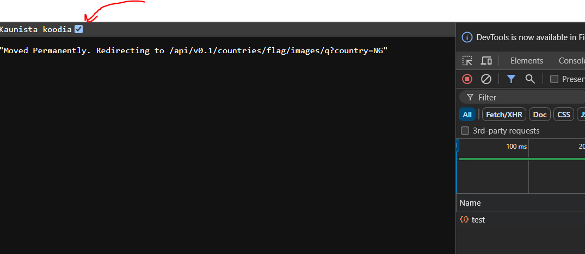

<p align="center">
    
</p>

## Challenge description: COUNTRY SERVICE.

Implement a microservice which provides a list of countries and, in addition, provides more detailed information per country.

- Requirements:
1. Use spring-boot.
	- https://start.spring.io/.
	- https://spring.io/guides/gs/spring-boot/.
2. Use maven.
	- https://spring.io/guides/gs/maven/.
	- https://www.baeldung.com/maven.
3. Use best practices and microservice approach.
4. Implement the following REST API with spring-boot:
 
```
GET /countries/
response:
          {
                   "countries": [
                             {
                                       "name": "Finland",
                                       "country_code": "FI"
                             },
                             ...
                   ]
          }
```
```
GET /countries/{name}
response:
          {
                   "name": "Finland",
                   "country_code": "FI",
                   "capital": "Helsinki",
                   "population": 5491817,
                   "flag_file_url": "<url to the flag file>"
          }
```

5. Country service must fetch the relevant information for countries from some other service.
	- You could use for example the following service: `https://countriesnow.space/`.
6. Test the implementation as well as it's needed from your perspective.
7. All the implementations must be runnable locally with our own computer. Write needed instructions to README.md file.
8. Publish all sources code and relevant files in github or similar service and send the link to the repo so that the implementation can be reviewed.

You get bonus points if:

- You use and understand [Reactor](https://www.baeldung.com/reactor-core).
- You create a separate wep application which utilizes the created REST API and shows the relevant country information in a browser.

## Architecture Explanation.

- [](https://spring.io/), [](https://docs.spring.io/spring-framework/reference/web/webflux.html) and [](https://projectreactor.io/).
    - Since this was in context of **Reactor**. I decided to use reactive approach, **Spring WebFlux**. 
- [](https://docs.spring.io/spring-framework/reference/web/webflux-webclient.html).
    - ✅ **WebClient** ✅ Interacting with 3rd party endpoints, WebClient was chosen for making non-blocking & asynchronous endpoint.
    - ❌ **RestTemplate** ❌ Older way to make calls in Spring and synchronous. [RestTemplate](https://www.baeldung.com/rest-template).
    - ❌ **Feign Client** ❌ Also synchronous. [Feign Client](https://www.baeldung.com/spring-boot-feignclient-vs-webclient).
- [](https://projectreactor.io/docs/netty/1.1.21/reference/index.html).
    - ✅**Netty**✅ is suited for Microservices Architecture, for its non-blocking I/O client-server nature.
- [](https://docs.spring.io/spring-framework/reference/web/webflux.html). 
    - ✅**Lombok**✅ For reducing boilerplate code.

- We are making `application.yml` for this microservices.
    - If this microservice would ran in different environment. 

- Domain classes represents classes inside business logic.
- DTO classes represents REST API and are modeled using `countriesnow.space` API nesting structure. Meaning package names is from API paths and DTO class names tries to represent the given thing. I chose not make DTO classes as reusable as possible, every DTO is unique.
- I have decided to use **ResponseEntity** from **Controller** class. [ReadMore](https://www.baeldung.com/spring-response-entity).

> While **ResponseEntity** is very powerful, we shouldn’t overuse it. In simple cases, there are other options that satisfy our needs and they result in much cleaner code.

# How to run!

Get the repository.

```bash
git clone https://github.com/developersCradle/springboot-microservices.git
```

# Front end.

<p align="center">
    
</p>

- As being back end developer front end is low priority, but for now it has somewhat working list! Focusing now back end test/docker/running.

## How to run the front end.

Run `ng serve` for a dev server. Navigate to `http://localhost:4200/`. The application will automatically reload if you change any of the source files.

# Back end.

## How to run the back end.

# Docker way.

Just start the containers by running the following command:

```bash
docker compose up
```

# Maven.

```bash
Cool mvn command here!
```

# Anomalies 🔎👀.

<details>
<summary id="problem1">Weird Feature 1.</summary>

- I came to notice when making **POST** request to the address of `https://countriesnow.space/api/v0.1/countries/population` it would work for **PostMan**, but not for **ReactorNetty**.

- Tool to catch the request were **Request Catcher**, it helped me to distinguish if there were some error in the request what **ReactorNetty** was making. URL of catcher `https://test.requestcatcher.com/`. **POST** didn't work for some reason and could not get any stream of data back from **Web Client** using DTO classes.
    - I Noticed the only difference mainly was headers. Upper picture from **ReactorNetty** request and below it is from **PostMan**, which worked. I tried to change **User-Agent** to `User-Agent: PostmanRuntime/7.42.0` in **ReactorNetty** so it would work, but my luck failed. 


- Due to the inspections how PostMan had it working with this API. It had following settings `Accept: */*`. 

- Luckily returning `Mono<String>` from **POST** function and setting `@Data` with POST param DTO class with the changing **NettyReactor** headers to `"Accept", MediaType.ALL_VALUE` from `"Accept", MediaType.APPLICATION_JSON_VALUE`(since API gives JSON), gave me positive surprise.

```
    @Bean
    public WebClient webClient(WebClient.Builder builder) {
        return builder.defaultHeader(
        		"Accept", MediaType.ALL_VALUE)
        		.build();
    }
```

- With DTO class.

```
@Data
@AllArgsConstructor
public class ParamClass {
	String country;
}
```
- Below positive surprise. I was not crazy and seeing things.


- Also, WebClient started to worked normally after right Header information `.doOnSuccess(result -> System.out.println("Response: " + result));` gave me `Response: Moved Permanently. Redirecting to /api/v0.1/countries/population/q?country=Finland`.

- All thought it was saying **redirecting**, i could not catch redirect message in network tab. Maybe it was due **ReactorNetty** needs to be configured to process these one, but for now i decided to just use this **hint** as API query and move forward with the task :)


</details>
<details>
<summary id="problem2">Weird Feature 2.</summary>

- I came to same conclusion as last error message when making **POST** request to the address of `https://countriesnow.space/api/v0.1/countries/flag/images` it would work for **PostMan**, but not for **ReactorNetty**. This time message was `"Moved Permanently. Redirecting to /api/v0.1/countries/flag/images/q?country=NG"` and i had much fun clicking eastern egg like 5 minutes :D. No redirect messages again.



</details>
<details>
<summary id="problem3">Weird Feature 3.</summary>

- Again the same `https://countriesnow.space/api/v0.1/countries/capital` it would work for **PostMan**, but not for **ReactorNetty**. This time message was `"Moved Permanently. Redirecting to /api/v0.1/countries/capital/q?country=nigeria"` click, click. No redirect messages again.


</details>
 
 